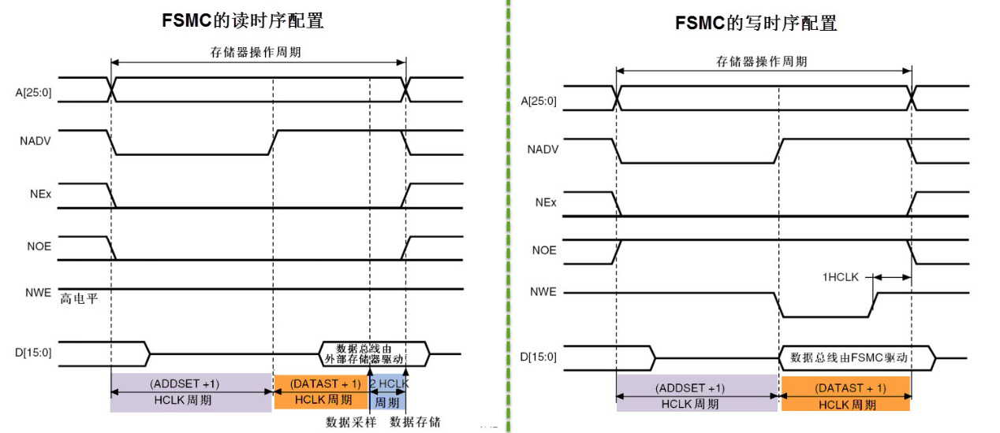
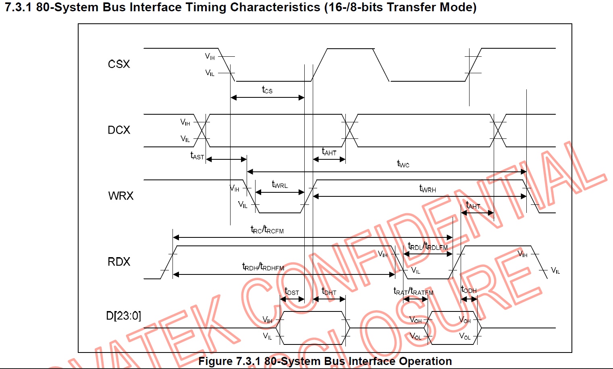
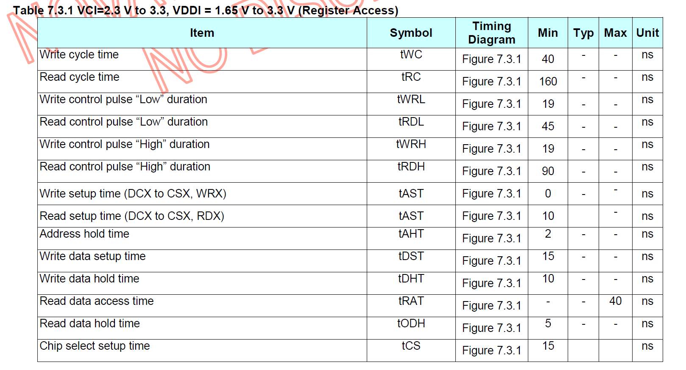

# FSMC
>FSMC(Flexible Static Memory Controller，可变静态存储控制器)是STM32系列采用的一种新型的存储器扩展技术。在外部存储器扩展方面具有独特的优势，可根据系统的应用需要，方便地进行不同类型大容量静态存储器的扩展。

**时序图**

## NT35310芯片

### 8080接口时序图

### 参数值

### 编程用值

读时序：(ADDSET + 1) * 1/HCLK >= 10 ns

​				(DATASET + 3) * 1/HCLK >= 50 ns

写时序：(ADDSET + 1) * 1/HCLK >= 0 ns

​				(DATASET + 1) * 1/HCLK >= 29 ns
