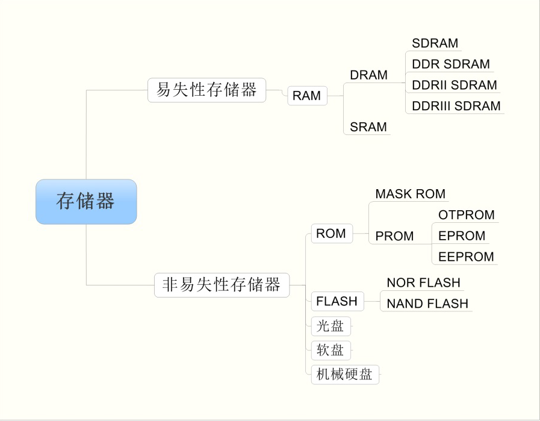
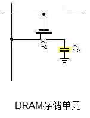
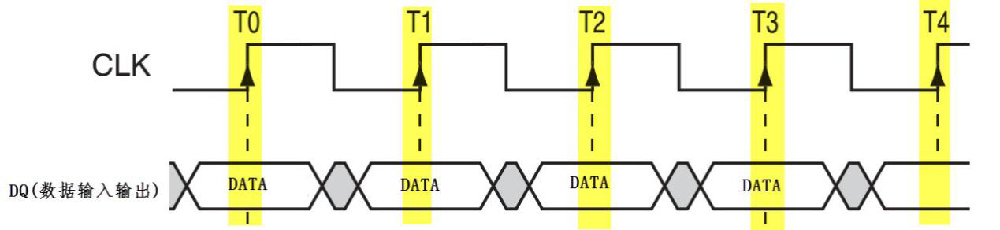
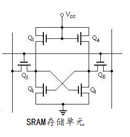

# 存储器

---

> ​	存储器按其内存介质特性主要分为“**易失性存储器**”和**非易失性存储器**“两大类。其中”易失性“或”非易失性“是指存储器断电后，它存储的数据内容是或会丢失的特性。由于一般易失性存储器存取速度快，而非易失性存储器可长期保存数据，它们都在计算机中占据着重要角色。在计算机中易失性存储器最典型的代表是内存，非易失性存储器的代表则是硬盘。

---

## 易失性存储器

### RAM（随机存取存储器)

​	RAM（Random Access Memory)是**随机存取存储器**，”**随机存取**“指的是当存储器中的消息被读取或写入时，所需要的时间与这段信息所在的	位置无关。

​	现在RAM已经专门用来指代作为计算机内存的易失性半导体存储器。

​	根据RAM的存储机制，又分为动态随机存储器DRAM（Dynamic RAM）以及静态随机存储器SRAM（Static RAM）两种。

#### DRAM（动态随机存取存储器）

​	动态随机存储器DRAM 的存储单元以电容的电荷来表示数据，有电荷代表1，无电荷代表0。但时间一长，代表1 的电容会放电，代表0 的电容会吸收电荷，因此它需要定期刷新操作，这就是“动态（Dynamic）”一词所形容的特性。刷新操作会对电容进行检查，若电量大于满电量的1/2，则认为其代表1，并把电容充满电；若电量小于1/2，则认为其代表0，并把电容放电，藉此来保证数据的正确性。

##### SDRAM（同步动态随机存取存储器）

​	根据DRAM 的通讯方式，又分为同步和异步两种，这两种方式根据通讯时是否需要使用时钟信号来区分。图 是一种利用时钟进行同步的通讯时序，它在时钟的上升沿表示有效数据。

​																		同步通讯时序图

​	由于使用时钟同步的通讯速度更快，所以同步DRAM 使用更为广泛，这种DRAM 被称为SDRAM（Synchronous DRAM）。

##### DDR SDRAM（Double Data Rate SDRAM）

​	为了进一步提高SDRAM 的通讯速度，人们设计了DDR SDRAM 存储器(Double Data Rate SDRAM)。它的存储特性与SDRAM 没有区别，但SDRAM 只在上升沿表示有效数据，在1 个时钟周期内，只能表示1 个有数据；而DDR SDRAM 在时钟的上升沿及下降沿各表示一个数据，也就是说在1 个时钟周期内可以表示2 位数据，在时钟频率同样的情况下，提高了一倍的速度。至于DDRII 和DDRIII，它们的通讯方式并没有区别，主要是通讯同步时钟的频率提高了。当前个人计算机常用的内存条是DDRIII SDRAM 存储器，在一个内存条上包含多个DDRIIISDRAM 芯片。

#### SRAM（静态随机存取存储器）

​	静态随机存储器SRAM 的存储单元以锁存器来存储数据，见图。这种电路结构不需要定时刷新充电，就能保持状态(当然，如果断电了，数据还是会丢失的)，所以这种存储器被称为“静态（Static）”RAM。

​	同样地，SRAM 根据其通讯方式也分为同步(SSRAM) 和异步SRAM，相对来说，异步SRAM 用得比较广泛。

#### DRAM 与 SRAM 的应用场合

​	对比DRAM 与SRAM 的结构，可知DRAM 的结构简单得多，所以生产相同容量的存储器，DRAM的成本要更低，且集成度更高。而DRAM 中的电容结构则决定了它的存取速度不如SRAM，特性对比见下表。

|     特性     | DRAM | SRAM |
| :----------: | :--: | :--: |
|   存取速度   | 较慢 | 较快 |
|    集成度    | 较高 | 较低 |
|   生产成本   | 较低 | 较高 |
| 是否需要刷新 |  是  |  否  |

​	所以在实际应用场合中，SRAM 一般只用于CPU 内部的高速缓存(Cache)，而外部扩展的内存一般使用DRAM。在STM32 系统的控制器中，只有STM32F429 型号或更高级的芯片才支持扩展SDRAM，其它型号如STM32F1、STM32F2 及STM32F407 等型号只能扩展SRAM。
